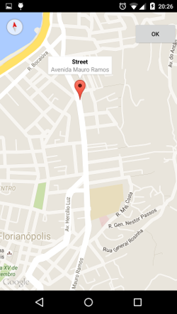
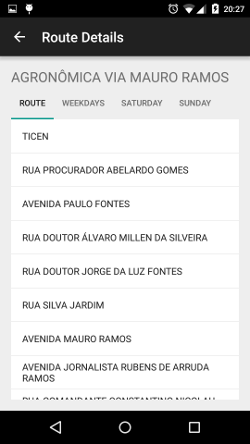
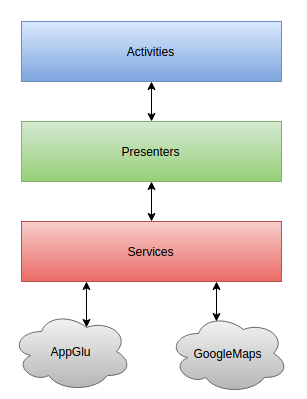

# Floripa by Bus

An Android based app for searching Bus Routes in Florianópolis.

## Views

This project contains three activities.

 * The MainActivity is where you can search the routes by street name.

 * On MapsActivity you can tap on the street location on the map to easily search by street name.

 * Finally the DetailsActivity shows the route list and the timetable divided by weekdays, Saturday and Sunday.

##Usage

This project doesn't have any external dependencies, just clone it from GitHub, compile and run.

With some luck it will work on the first try :-)

##Architecture

This app is based on the Model-View-Presenter Pattern.

